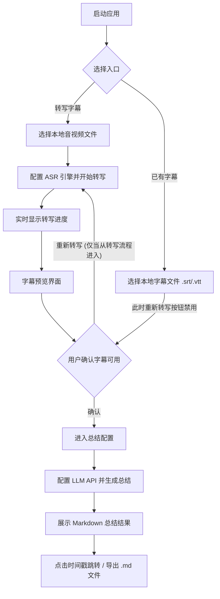

# VidSum 产品需求文档 (PRD) – MVP 版本

## 1. 产品定位（一句话）
VidSum 是一款将本地音视频文件智能转写并总结为带时间戳 Markdown 笔记的隐私优先桌面工具。

## 2. 用户故事（核心场景）

**场景1：快速获得一个视频的总结文本**
- 在B站看到一个对热点事件点评的自媒体视频
- 想要在不看视频的情况下通过分段落的总结快速了解其主要内容
- 也方便自己做个人对于该视频的笔记
- 以及可以根据段落标题处的视频事件点快速跳到相应的视频内容处，细看对应的视频内容

## 3. 功能清单（MVP范围）

### P0功能（必须有）

> ⚠️ **平台说明**：当前版本仅在 macOS 15 (x86_64) 完成完整验收。Windows/Linux 功能可用性待验证,预计 MVP 发布前补齐测试。

- **输入与任务创建**：
    - [x] 选择本地音视频文件（支持 mp4, mkv, mov, mp3, wav, m4a 等主流格式）。
    - [x] 直接选择本地字幕文件（.srt / .vtt）作为起点。
- **音频转文字 (ASR)**：
    - [x] 本地 Whisper 引擎（Tiny/Base/Small/Medium/Large 五种模型，支持 zh/en/ja/auto 语言选择，支持 MP3/MP4/WAV 输入自动重采样到 16kHz）。
    - [x] 云端 ASR 预留 OpenAI 兼容接口（可配置 API URL + Key + Model）。
    - [x] 转写过程实时进度条和当前转写文本显示。
    - [x] 输出 SRT 字幕文件和带时间戳的转写文本。
- **字幕确认与预览**：
    - [x] 转写完成后展示字幕预览区域（左侧时间轴列表 + 右侧段落详情，支持编辑文字、导出 SRT/VTT）。
    - [ ] 从已有字幕文件进入时，跳过 ASR 直接进入字幕预览，且"重新转写"按钮禁用。
    - [x] 用户手动点击"确认并进入总结"，将当前字幕作为总结输入源。
- **大模型总结**：
    - [x] 用户配置 OpenAI 兼容 API（Base URL、API Key、Model ID）。
    - [x] 用户可自定义编辑 System Prompt 和 User Prompt Template。
    - [x] 点击"生成总结"后，系统使用 Prompt 提交字幕全文。
    - [x] 输出包含 `[HH:MM:SS]` 时间戳锚点的分层 Markdown。
- **结果展示与导出**：
    - [x] Markdown 富文本预览（层级缩进、标题、列表等）。
    - [x] 支持导出为 `.md` 文件保存至本地。

### P1功能（最好有）
- 暂无

### P2功能（未来考虑）
- [ ] **URL 视频下载**：不支持通过粘贴链接下载网络视频，用户必须自行准备本地文件。
- [ ] **官方字幕自动提取**：不主动探测音视频文件中的内嵌字幕轨，也不自动下载网络字幕。
- [ ] **说话人分割**：转写字幕中不包含说话人标签（`[说话人_A]`），该功能推迟至 V1.1。
- [ ] **视频预览播放**：应用内不嵌入视频播放器，时间戳跳转依赖外部系统播放器。
- [ ] **批量处理与历史记录**：不支持多文件队列处理，不保存历史任务记录。

## 4. 核心流程图

